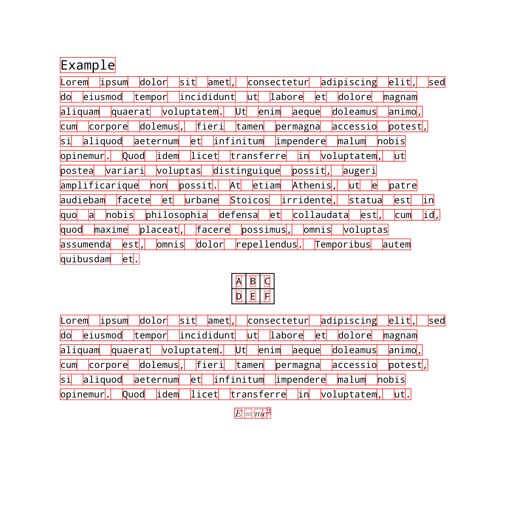

# Typst box extractor

Generates per-word bounding boxes for a Typst document, including PNG outputs and a JSON file with the exact bounding box coordinates.

You can run the example with

```
cargo run input.typ output.json --include-delimiters --include-whitespace
```

The rendered raw input is as follows


And the generated boxes

